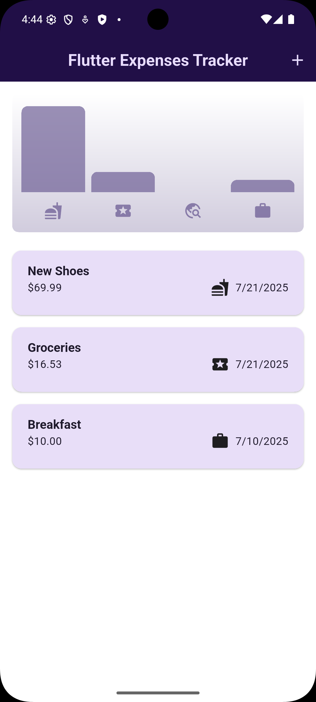
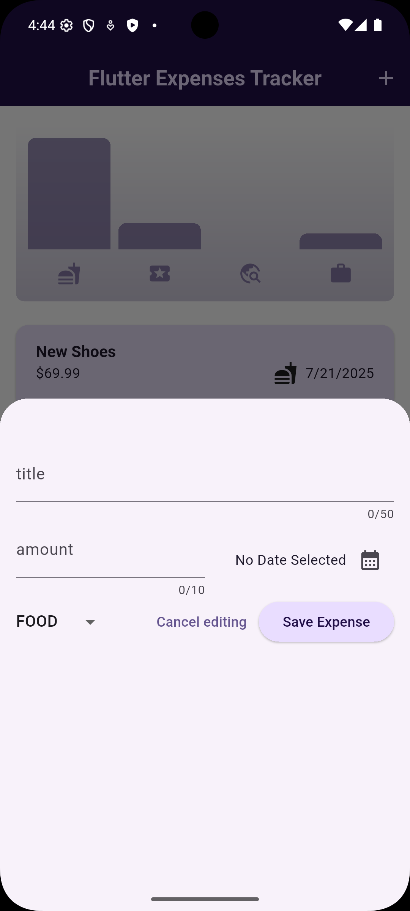

# Flutter Expense Tracker 💰

[](https://opensource.org/licenses/MIT)
[](https://flutter.dev/)
[](https://dart.dev/)
[](https://github.com/mahmoudasal/flutter-expense-tracker)
[](https://flutter.dev/)

## 📋 Overview

A cross-platform expense tracking app built with Flutter that helps you keep track of your spending. It's designed with a clean interface and follows Material Design principles to make managing your finances simple and enjoyable.

### 🎯 What Makes It Special
- **Works everywhere**: Runs on both Android and iOS devices
- **Looks modern**: Uses Google's Material Design 3 for a fresh, clean look
- **Adapts to you**: Responsive design that works on phones and tablets
- **Runs smooth**: Optimized for performance with smooth animations

## 🆕 Latest Updates

### 🎉 **Version 1.2.0 - Enhanced User Experience**

#### 📱 **Keyboard-Adaptive Modal Forms**
- **Smart Keyboard Handling**: Forms automatically adjust when keyboard appears
- **Dynamic Padding**: Content stays visible above the keyboard
- **Smooth Scrolling**: Seamless scrolling when content overflows
- **Safe Area Support**: Respects device notches and rounded corners

#### 📐 **Responsive Design Improvements**
- **Tablet-Optimized Layout**: Different form layouts for screens ≥600px
- **Landscape Mode Support**: Better experience in landscape orientation
- **Flexible Grid System**: Content adapts to available screen space
- **Cross-Platform Consistency**: Native feel on both iOS and Android

#### 🔧 **Technical Enhancements**
- **Platform-Specific Dialogs**: iOS uses Cupertino, Android uses Material
- **Improved Code Organization**: Better separation of concerns
- **Enhanced Comments**: More readable and maintainable codebase
- **Performance Optimizations**: Smoother animations and faster response times

---

<div align="center">
  <table>
    <tr>
      <td align="center">
        
        <br/>
        <b>Main Dashboard</b>
      </td>
      <td align="center">
        
        <br/>
        <b>Add Expense Form</b>
      </td>
    </tr>
  </table>
</div>


## ✨ Features

### 💼 Core Features
- 📊 **Expense Management**: Add, edit, and delete your expenses easily
- 🏷️ **Categories**: Sort expenses into Food, Travel, Leisure, or Work
- 📅 **Date Tracking**: Keep track of when you spent money
- 💰 **Amount Tracking**: Record exact amounts with decimal support
- 🔄 **Undo Feature**: Accidentally deleted something? No problem - just undo it

### 🎨 User Experience
- 📱 **Fully Responsive**: Works great on different screen sizes and orientations
- ⌨️ **Keyboard-Adaptive Forms**: Modal automatically adjusts when keyboard appears
- 📏 **Tablet-Optimized Layout**: Different layouts for screens ≥600px width
- 🎨 **Material Design**: Clean, modern interface that feels familiar
- 🌓 **Dark Mode**: Switches automatically with your system settings
- ⚡ **Fast**: Smooth animations and quick response times
- 🎯 **Easy to Use**: Simple navigation that makes sense
- 🔄 **Smart Scrolling**: Content scrolls smoothly when space is limited

### 🔧 Technical Features
- 🧱 **Well Organized**: Code is structured and easy to maintain
- 🔒 **Safe**: Uses Dart's null safety to prevent crashes
- 📊 **Ready for Charts**: Built with future analytics in mind
- 🔄 **Smart State**: Efficient updates without unnecessary redraws
- 🖥️ **Platform-Aware**: Uses native dialogs on iOS/Android
- 📐 **Responsive Architecture**: Adapts to different screen sizes automatically

## 🚀 Getting Started

### 📋 What You'll Need

Make sure you have these installed before starting:

| Tool | Version | What it's for |
|------|---------|---------------|
| [Flutter SDK](https://flutter.dev/docs/get-started/install) | 3.19.0+ | The main framework for building the app |
| [Dart SDK](https://dart.dev/get-dart) | 3.3.0+ | Programming language (comes with Flutter) |
| [Android Studio](https://developer.android.com/studio) or [VS Code](https://code.visualstudio.com/) | Latest | Where you'll write and test code |
| Android/iOS Device or Emulator | - | To run and test the app |

### 🔧 Setting Everything Up

1. **Get the Code**
   ```bash
   # Download the project
   git clone https://github.com/mahmoudasal/flutter-expense-tracker.git
   
   # Go into the project folder
   cd flutter-expense-tracker
   ```

2. **Check Your Setup**
   ```bash
   # Make sure Flutter is working properly
   flutter doctor -v
   ```

3. **Install Dependencies**
   ```bash
   # Download all the packages we need
   flutter pub get
   ```

4. **Run the App**
   ```bash
   # Start the app on your device
   flutter run
   
   # Or run in debug mode for development
   flutter run --debug
   ```

### 🏗️ Building for Release

#### 📱 Android
```bash
# Create an APK file
flutter build apk --release

# Create an App Bundle (better for Google Play Store)
flutter build appbundle --release

# Build with code obfuscation for extra security
flutter build apk --release --obfuscate --split-debug-info=build/app/outputs/symbols
```

#### 🍎 iOS
```bash
# Build for iOS
flutter build ios --release
```

### 🔍 Useful Commands

```bash
# Run tests
flutter test

# Check code quality
flutter analyze

# Format your code nicely
dart format .

# See which packages need updates
flutter pub outdated
```

## 📂 Project Architecture

The project follows a **feature-based modular architecture** with clear separation of concerns:

```
lib/
├── 📄 main.dart                    # Application entry point & theme configuration
├── 📄 expenses.dart               # Main expense dashboard & state management
├── 📁 models/                     # Data models & business logic
│   └── 📄 expense.dart           # Expense model & ExpenseBucket utility class
└── 📁 widgets/                   # Reusable UI components
    ├── 📄 new_expense.dart       # Expense creation form widget
    ├── 📁 charts/                # Data visualization components
    └── 📁 expenses_list/         # Expense list & item components
```

### 🏗️ Architecture Principles

- **Separation of Concerns**: Clear distinction between UI, business logic, and data layers
- **Widget Composition**: Modular, reusable UI components
- **State Management**: Efficient state handling with minimal widget rebuilds
- **Type Safety**: Comprehensive use of Dart's type system and null safety

### 📊 Data Flow

```
User Interaction → Widget → State Management → Model Update → UI Refresh
```

## � Dependencies & Packages

### 🏗️ Core Dependencies
| Package | Version | Purpose |
|---------|---------|---------|
| [flutter](https://flutter.dev/) | SDK | Cross-platform UI framework |
| [uuid](https://pub.dev/packages/uuid) | ^4.0.0 | Unique identifier generation for expense records |
| [intl](https://pub.dev/packages/intl) | ^0.19.0 | Internationalization support & date formatting |
| [cupertino_icons](https://pub.dev/packages/cupertino_icons) | ^1.0.6 | iOS-style iconography |


### 📋 Development Dependencies
- `flutter_test`: Testing framework
- `flutter_lints`: Dart linting rules for code quality

## 📖 Usage Guide

### 🎯 Core Operations

1. **Adding New Expenses**
   - Tap the floating action button (➕) in the app bar
   - Fill in the expense details:
     - **Title**: Descriptive name for the expense
     - **Amount**: Monetary value (supports decimal precision)
     - **Date**: When the expense occurred (date picker integration)
     - **Category**: Select from predefined categories
   - Submit to add the expense to your records

2. **Expense Categorization**
   - **🍕 Food**: Meals, groceries, dining expenses
   - **✈️ Travel**: Transportation, accommodation, travel-related costs
   - **🎭 Leisure**: Entertainment, hobbies, recreational activities
   - **💼 Work**: Professional expenses, office supplies, business costs

3. **Data Management**
   - **View Expenses**: Browse chronologically organized expense list
   - **Delete Expenses**: Swipe-to-delete with confirmation dialog
   - **Undo Actions**: Restore accidentally deleted expenses
   - **Real-time Updates**: Immediate reflection of changes in UI

### 🎨 User Interface Elements

- **Adaptive Theming**: Automatic light/dark mode based on system settings
- **Material Design 3**: Modern color schemes and component styling
- **Responsive Layout**: Optimized for both portrait and landscape orientations
- **Accessibility**: Screen reader support and keyboard navigation

## 🤝 Contributing

Contributions are welcome! Please feel free to submit a Pull Request. For major changes, please open an issue first to discuss what you would like to change.

### How to Contribute

1. **Fork the repository**
2. **Create a feature branch**
   ```bash
   git checkout -b feature/amazing-feature
   ```
3. **Commit your changes**
   ```bash
   git commit -m 'feat: add amazing feature'
   ```
4. **Push to the branch**
   ```bash
   git push origin feature/amazing-feature
   ```
5. **Open a Pull Request**

### Commit Message Convention

This project follows [Conventional Commits](https://www.conventionalcommits.org/):

- `feat:` - New features
- `fix:` - Bug fixes
- `docs:` - Documentation changes
- `style:` - Code style changes (formatting, etc.)
- `refactor:` - Code refactoring
- `test:` - Adding or updating tests
- `chore:` - Maintenance tasks

## 🐛 Known Issues

- None currently identified

## 🗺️ Roadmap & Future Enhancements

### ✅ **Recently Completed (v1.2.0)**
- [x] **📱 Responsive Design**: Full responsive layout with keyboard adaptation
- [x] **🎨 Enhanced Forms**: Modal bottom sheets with dynamic sizing
- [x] **📐 Tablet Support**: Optimized layouts for larger screens
- [x] **🖥️ Platform-Aware UI**: Native dialogs for iOS and Android

### 🚀 Version 2.0 (Q3 2025)
- [ ] **📊 Advanced Analytics**: Interactive charts and spending insights
- [ ] **💾 Data Persistence**: Local SQLite database integration
- [ ] **🎨 Custom Categories**: User-defined expense categories
- [ ] **📤 Export Functionality**: CSV, PDF, and Excel export options

### 🚀 Version 3.0 (Q4 2025)
- [ ] **🌙 Enhanced Theming**: Full dark mode implementation with custom themes
- [ ] **☁️ Cloud Sync**: Backup and synchronization across devices
- [ ] **💰 Budget Management**: Budget setting and spending alerts
- [ ] **🔔 Smart Notifications**: Spending reminders and budget warnings

### 🚀 Future Considerations
- [ ] **🌍 Multi-currency Support**: International currency handling
- [ ] **📱 Widget Support**: Home screen widgets for quick expense entry
- [ ] **🤖 AI Insights**: Machine learning-based spending pattern analysis
- [ ] **👥 Multi-user Support**: Shared expense tracking for families/teams

### 📈 Performance Improvements
- [ ] **⚡ Code Optimization**: Enhanced app startup time and memory usage
- [ ] **🔄 State Management**: Migration to advanced state management solutions
- [ ] **🏗️ Architecture Refactoring**: Clean Architecture implementation

## 📄 License

This project is licensed under the MIT License - see the [LICENSE](LICENSE) file for details.

## 🙏 Acknowledgments & Credits

### 📚 Learning Resources
- **Flutter Documentation** - Official comprehensive guides
- **Dart Language Tour** - Language fundamentals and best practices
- **Material Design Guidelines** - Design principles and component specifications

### 🔧 Development Tools
- **VS Code** with Flutter extensions for development
- **Android Studio** for Android-specific debugging
- **Firebase** for future cloud integration planning

## 📞 Support & Community

### 🐛 Bug Reports
If you encounter any issues, please report them using our [Issue Tracker](https://github.com/mahmoudasal/flutter-expense-tracker/issues) with:
- Detailed description of the problem
- Steps to reproduce
- Device information and Flutter version
- Screenshots (if applicable)

### 🌟 Show Your Support
If this project has been helpful:
- ⭐ **Star the repository** on GitHub
- 🍴 **Fork and contribute** to the codebase
- 📢 **Share** with the Flutter community
- 💬 **Leave feedback** and suggestions

---

<div align="center">
  
  **Made with ❤️ using Flutter**
  
  
  
  
  *© 2025 Mahmoud Asal. Licensed under MIT License.*
  
</div>


